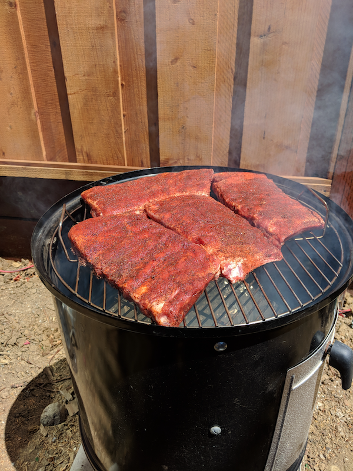

Cooking ribs on July 20, 2018 using the Weber Smoky Mountain smoker.

Here's what they looked like to start:



This code plots the meat and air temperature, both measured using the Maverick BBQ thermometer.  The cooker temperature is remarkably stable today, with little need to futz with the vents.

```{r}
library(ggplot2)
library(dplyr)
library(tidyr)

time=c('11:40','11:50','12:00','12:12')
meatTemp=c(59,81,117,140)
airTemp=c(201,212,210,217)

hm=as.POSIXct(strptime(time, '%H:%M',tz='GMT')) 
df=data.frame(meatTemp,airTemp,hm) %>%
  gather(source,temp,-hm)
ggplot(df,aes(hm,temp,color=source)) + 
  geom_line() + 
  ylab('Temperature') +
  xlab('Time') 
  

```

